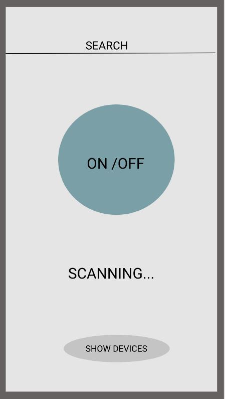
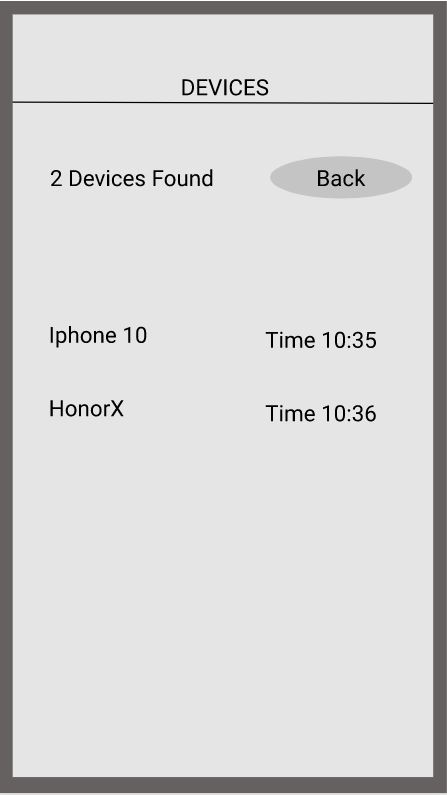
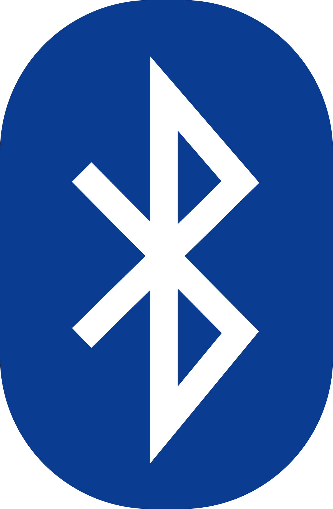

## Welcome to our page

With this app you can locate and find your bluetooth devices using the received signal strength indication (rssi), the closer you get, the stronger the signal will be. DOES NOT WORK WITH HEADSET.
The devices will be displayed in a list with their: name, time of discovery and a graphical signal strength. Depending on the device the signal strength could be updated on 1-10 seconds intervals.
This application has many features that will please any user.
<ol>
  <li>Сreating many profiles</li>
  <li>Switch accounts</li>
  <li>Вluetooth connection status indicator</li
  <li> Bluetooth notifications</li>
</ol>

### Careers

INC team believes in connecting the world without wires, we wants that everyone could be able to connect in secure, easy and wireless way. In our INC team work environment  we are seeking to find the purpose in the work creatively. by working hard our aim is to always win, during official working hours. one of our best thing in our work is balance and collaborating  with our clients we respect them.      

Increase awareness and understanding using bluetoothtechnology, to connect the whole world without using wires. 

### About the APP

This App was created by GM-DT's team and developed by INC's team. 

Your Pages site will use the layout and styles from the Jekyll theme you have selected in your [repository settings](https://github.com/Eszter96/INC_bluetooth_app/settings). The name of this theme is saved in the Jekyll `_config.yml` configuration file.

### Support or Contact

Having trouble with Pages? Check out our [documentation](https://docs.github.com/categories/github-pages-basics/) or [contact support](https://support.github.com/contact) and we’ll help you sort it out.
